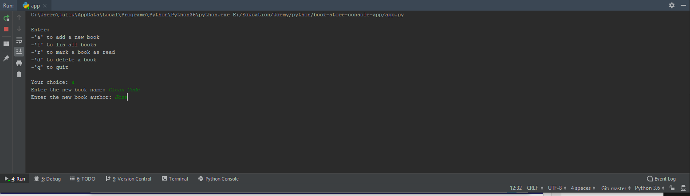

# Book Store Console App
> A console-based book store system that allows users to enter and retrieve book details, as well as mark books as read, and delete existing books.

## Table of contents
* [General info](#general-info)
* [Screenshots](#screenshots)
* [Technologies](#technologies)
* [Setup](#setup)
* [Features](#features)
* [Status](#status)
* [Inspiration](#inspiration)
* [Contact](#contact)

## General info
The goal of this project is to show my portifolio to the world.

## Screenshots

## Technologies
* PyCharm
* Python
* sqlite3
* JSON

## Setup
Since it was a simple app, there was not much setup required.

## Features
Features ready:
* Add a new book
* List all books
* Mark a book as read
* Delete a book
* Quit the app

To-do list:
* None

## Status
Project is: _finished_,

## Inspiration
Project based on online course I took on Udemy.

## Contact
Created by Julius Mushi - feel free to contact me!
